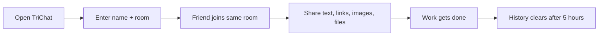

<div align="center">

# TriChat

### Temporary anonymous rooms for quick sharing between nearby devices.

No account. No phone login. No personal messenger on shared PCs.

**Open a room. Share what you need. Everything clears after 5 hours.**

<p>
  <a href="https://parthmax-trichat.hf.space"></a>
  
  
  
</p>

<p>
  <a href="https://parthmax-trichat.hf.space"><b>Live Demo</b></a>
  &middot;
  <a href="#quick-start"><b>Quick Start</b></a>
  &middot;
  <a href="#the-little-office-problem"><b>Story</b></a>
  &middot;
  <a href="#how-it-works"><b>Architecture</b></a>
</p>

</div>

<p align="center">
  
</p>

<table>
  <tr>
    <td align="center" width="20%">
      <b>PC-1</b><br /><br />
      <code>open</code><br />
      <sub>no login</sub>
    </td>
    <td align="center" width="60%">
      <h3>room: <code>project-drop</code></h3>
      <p>
        <code>files</code>
        <code>links</code>
        <code>notes</code>
        <code>images</code>
      </p>
      <sub>quick exchange, same room, any browser</sub>
    </td>
    <td align="center" width="20%">
      <b>PC-2</b><br /><br />
      <code>join</code><br />
      <sub>same room</sub>
    </td>
  </tr>
  <tr>
    <td align="center" colspan="3">
      <b>Temporary by design</b>
      &nbsp;&middot;&nbsp;
      <code>auto-delete after 5 hours</code>
    </td>
  </tr>
</table>

<table>
  <tr>
    <td align="center" width="25%"><b>No Login</b><br /><sub>Open a room instantly.</sub></td>
    <td align="center" width="25%"><b>Share Fast</b><br /><sub>Drop files, links, and notes.</sub></td>
    <td align="center" width="25%"><b>Temporary</b><br /><sub>History clears after 5 hours.</sub></td>
    <td align="center" width="25%"><b>Any Device</b><br /><sub>Works in a browser.</sub></td>
  </tr>
</table>

---

## The Little Office Problem

<table>
  <tr>
    <td width="48%">
      
    </td>
    <td width="52%">
      <h3>Three friends. Three computers. One tiny task.</h3>
      <blockquote>
        Can you send me that file?<br /><br />
        Sure. Wait... should I log into WhatsApp Web on your PC?<br /><br />
        Maybe email?<br /><br />
        No no, I do not want my personal account open here.
      </blockquote>
      <p>
        And suddenly, sharing one small file becomes a whole ritual: open a personal messenger, scan a QR code, wait for sync, remember to log out, and hope nothing private stays open.
      </p>
    </td>
  </tr>
</table>

So TriChat started as a tiny escape hatch.

Not a social network. Not a permanent chat app. Just a quick temporary room where teammates can drop files, links, and notes without logging into personal accounts.

---

## The Idea

<table>
  <tr>
    <td width="52%">
      <h3>What if sharing between office PCs felt like passing a sticky note?</h3>
      <ol>
        <li>Create a room.</li>
        <li>Tell your friend the room name.</li>
        <li>Drop files, links, images, or text.</li>
        <li>Leave when the work is done.</li>
        <li>History disappears after 5 hours.</li>
      </ol>
    </td>
    <td width="48%">
      
    </td>
  </tr>
</table>

That is TriChat.

<table>
  <tr>
    <th align="left">Need</th>
    <th align="left">TriChat answer</th>
  </tr>
  <tr>
    <td>Move a file from one PC to another</td>
    <td>Join the same room and upload it</td>
  </tr>
  <tr>
    <td>Avoid WhatsApp, email, or personal logins</td>
    <td>No account needed</td>
  </tr>
  <tr>
    <td>Share quick links or notes</td>
    <td>Send them as room messages</td>
  </tr>
  <tr>
    <td>Avoid long-term clutter</td>
    <td>Auto-clears after 5 hours</td>
  </tr>
  <tr>
    <td>Use any device nearby</td>
    <td>Works in a browser</td>
  </tr>
</table>

---

## Features

<table>
  <tr>
    <td width="33%"><b>Anonymous rooms</b><br /><sub>Join with a name and room. No account ceremony.</sub></td>
    <td width="33%"><b>Quick sharing</b><br /><sub>Send text, links, images, and files between devices.</sub></td>
    <td width="33%"><b>Realtime chat</b><br /><sub>WebSocket-powered messages feel instant.</sub></td>
  </tr>
  <tr>
    <td><b>5-hour expiry</b><br /><sub>Messages and uploaded files are temporary by design.</sub></td>
    <td><b>Room cache</b><br /><sub>Small in-memory cache keeps recent room loading snappy.</sub></td>
    <td><b>Self-hostable</b><br /><sub>Run locally, in Docker, or on Hugging Face Spaces.</sub></td>
  </tr>
</table>

---

## Sharing Flow

<p align="center">
  
</p>



---

## Temporary By Design

<table>
  <tr>
    <td width="48%">
      
    </td>
    <td width="52%">
      <h3>Built to disappear after the job is done.</h3>
      <p>Every saved message and uploaded file gets an expiry time.</p>
      <p><code>created_at + 5 hours = expires_at</code></p>
      <p>The cleanup worker runs in the background and removes expired database messages, uploaded files, and stale cached history.</p>
      <p><b>TriChat is intentionally short-lived.</b> It is for quick exchange, not forever storage.</p>
    </td>
  </tr>
</table>

---

## Quick Start

<details open>
<summary><b>Run TriChat locally</b></summary>
<br />

```bash
git clone https://github.com/parthmax2/TriChat.git
cd TriChat
pip install -r requirements.txt
```

Create your environment file:

```bash
cp .env.example .env
```

Fill in:

```env
SUPABASE_URL=https://your-project-ref.supabase.co
SUPABASE_SERVICE_ROLE_KEY=your-supabase-secret-key
SUPABASE_BUCKET=chat-files
ROOM_HISTORY_HOURS=5
HISTORY_CACHE_SECONDS=30
CLEANUP_INTERVAL_SECONDS=600
PORT=7860
```

Run it:

```bash
uvicorn app:app --reload --port 7860
```

Open:

```text
http://127.0.0.1:7860
```

</details>

---

## Setup

<details open>
<summary><b>1. Create The Database</b></summary>
<br />

In your Supabase SQL editor, run:

```text
supabase_schema.sql
```

This creates the `messages` table and adds:

- `expires_at` for 5-hour cleanup
- `file_path` so uploaded files can be deleted from storage
- indexes for faster room history

</details>

<details open>
<summary><b>2. Create The File Bucket</b></summary>
<br />

Create a public storage bucket named:

```text
chat-files
```

TriChat stores uploaded files there and deletes expired file objects during cleanup.

</details>

<details open>
<summary><b>3. Add Environment Variables</b></summary>
<br />

Use `.env.example` as your guide.

Never commit your real `.env` file.

</details>

---

## How It Works

<details open>
<summary><b>Architecture map</b></summary>
<br />

<table>
  <tr>
    <td align="center"><b>Browser</b><br /><sub>room UI</sub></td>
    <td align="center"><b>FastAPI</b><br /><sub>routes + WebSockets</sub></td>
    <td align="center"><b>Supabase Postgres</b><br /><sub>room history</sub></td>
    <td align="center"><b>Supabase Storage</b><br /><sub>uploaded files</sub></td>
  </tr>
  <tr>
    <td align="center" colspan="4">
      <code>open room</code>
      &nbsp;&rarr;&nbsp;
      <code>send message/file</code>
      &nbsp;&rarr;&nbsp;
      <code>sync realtime</code>
      &nbsp;&rarr;&nbsp;
      <code>cleanup expired data</code>
    </td>
  </tr>
</table>

</details>

Core stack:

<table>
  <tr>
    <th align="left">Layer</th>
    <th align="left">Tool</th>
    <th align="left">Why it is here</th>
  </tr>
  <tr>
    <td>Backend</td>
    <td><code>FastAPI</code></td>
    <td>Serves the app, APIs, uploads, and room logic.</td>
  </tr>
  <tr>
    <td>Realtime</td>
    <td><code>WebSockets</code></td>
    <td>Keeps room messages live across devices.</td>
  </tr>
  <tr>
    <td>Database</td>
    <td><code>Supabase Postgres</code></td>
    <td>Stores temporary messages with expiry timestamps.</td>
  </tr>
  <tr>
    <td>File storage</td>
    <td><code>Supabase Storage</code></td>
    <td>Stores uploaded files until cleanup removes them.</td>
  </tr>
  <tr>
    <td>Deployment</td>
    <td><code>Docker</code> / <code>Hugging Face Spaces</code></td>
    <td>Makes the project easy to run and share.</td>
  </tr>
</table>

---

## Test The Integration

Run:

```bash
python test.py
```

Expected result:

```text
Supabase database integration successful.
Inserted, read, and deleted test row id: ...
```

---

## Perfect For

<table>
  <tr>
    <td width="50%"><b>Office teammates</b><br /><sub>Move files across shared PCs without personal logins.</sub></td>
    <td width="50%"><b>Computer labs</b><br /><sub>Share notes and files between lab machines.</sub></td>
  </tr>
  <tr>
    <td><b>Hackathon teams</b><br /><sub>Drop links, screenshots, builds, and quick notes.</sub></td>
    <td><b>Support desks</b><br /><sub>Create a temporary room for fast exchange.</sub></td>
  </tr>
</table>

---

## Safety Note

<table>
  <tr>
    <td>
      <b>TriChat is built for quick temporary exchange, not permanent private storage.</b><br /><br />
      Do not share passwords, private keys, confidential company documents, or anything that should not appear in a public temporary room.
    </td>
  </tr>
</table>

---

## The Short Story

I built TriChat because my coworkers and I often needed to move files between office PCs.

Using WhatsApp Web was annoying because nobody wanted to log into a personal account on someone else's computer.

TriChat is a temporary anonymous room: open a room, share files or links, and the history clears after 5 hours.

---

## Roadmap

<table>
  <tr>
    <td>Copy invite link button</td>
    <td>Room expiry countdown in the UI</td>
  </tr>
  <tr>
    <td>Drag-and-drop file upload</td>
    <td>Dark mode</td>
  </tr>
  <tr>
    <td>Optional room password</td>
    <td>One-click deploy buttons</td>
  </tr>
</table>

---

<p align="center">
  
</p>

<div align="center">

### Open a room. Share the thing. Leave no mess.

Temporary rooms. Quick sharing. No personal login.

<p>
  <a href="https://parthmax-trichat.hf.space"><b>Try TriChat live</b></a>
  &middot;
  <a href="#quick-start"><b>Run locally</b></a>
</p>

</div>
