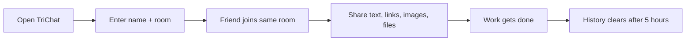

<div align="center">

# TriChat

### Temporary anonymous rooms for quick file sharing between devices.

No account. No phone login. No personal messenger on shared PCs.

**Open a room. Share what you need. Everything clears after 5 hours.**

<p>
  <a href="https://huggingface.co/spaces/parthmax/TriChat"></a>
  
  
  
</p>

<p>
  <a href="https://huggingface.co/spaces/parthmax/TriChat"><b>Live Demo</b></a>
  ·
  <a href="#quick-start"><b>Quick Start</b></a>
  ·
  <a href="#the-little-office-problem"><b>Story</b></a>
  ·
  <a href="#how-it-works"><b>Architecture</b></a>
</p>

</div>

<p align="center">
  
</p>

```text
        [ PC-1 ]  ---- room: project-drop ----  [ PC-2 ]
            \                                      /
             \---- files, links, notes, images ---/

                 temporary by design: 5 hours
```

<table>
  <tr>
    <td align="center"><b>No Login</b><br />Open a room instantly.</td>
    <td align="center"><b>Share Fast</b><br />Drop files, links, and notes.</td>
    <td align="center"><b>Temporary</b><br />History clears after 5 hours.</td>
    <td align="center"><b>Any Device</b><br />Works in a browser.</td>
  </tr>
</table>

---

## The Little Office Problem

| | |
| --- | --- |
|  | **Scene: three friends at work. Three computers. One tiny task.**<br><br>> "Can you send me that file?"<br><br>> "Sure. Wait... should I log into WhatsApp Web on your PC?"<br><br>> "Maybe email?"<br><br>> "No no, I don't want my personal account open here."<br><br>And suddenly, sharing one small file becomes a whole ritual: open a personal messenger, scan a QR code, wait for sync, remember to log out, and hope nothing private stays open. |

So TriChat started as a tiny escape hatch.

Not a social network. Not a permanent chat app. Just a quick temporary room where teammates can drop files, links, and notes without logging into personal accounts.

---

## The Idea

| | |
| --- | --- |
| **What if sharing between office PCs felt like passing a sticky note?**<br><br>1. Create a room<br>2. Tell your friend the room name<br>3. Drop files, links, or text<br>4. Leave<br>5. History disappears after 5 hours |  |

That is TriChat.

| Need | TriChat Answer |
| --- | --- |
| Move a file from one PC to another | Join the same room and upload it |
| Avoid logging into WhatsApp or email | No account needed |
| Share quick links or notes | Send them as messages |
| Avoid long-term clutter | Auto-clears after 5 hours |
| Use any device | Works in a browser |

---

## Features

<table>
  <tr>
    <td><b>Anonymous rooms</b><br />Join with a name and room. No account ceremony.</td>
    <td><b>Quick sharing</b><br />Send text, links, images, and files between devices.</td>
    <td><b>Realtime chat</b><br />WebSocket-powered messages feel instant.</td>
  </tr>
  <tr>
    <td><b>5-hour expiry</b><br />Messages and uploaded files are temporary by design.</td>
    <td><b>Room cache</b><br />Small in-memory cache keeps recent room loading snappy.</td>
    <td><b>Self-hostable</b><br />Run it locally, in Docker, or on Hugging Face Spaces.</td>
  </tr>
</table>

---

## Sharing Flow

<p align="center">
  
</p>



---

## Temporary By Design

| | |
| --- | --- |
|  | Every saved message and uploaded file gets an expiry time.<br><br>`created_at + 5 hours = expires_at`<br><br>The cleanup worker runs in the background and removes expired database messages, uploaded files, and stale cached history.<br><br>TriChat is intentionally short-lived. It is for quick exchange, not forever storage. |

---

## Quick Start

<details open>
<summary><b>Run TriChat locally</b></summary>
<br />

```bash
git clone https://github.com/parthmax2/TriChat.git
cd TriChat
pip install -r requirements.txt
```

Create your environment file:

```bash
cp .env.example .env
```

Fill in:

```env
SUPABASE_URL=https://your-project-ref.supabase.co
SUPABASE_SERVICE_ROLE_KEY=your-supabase-secret-key
SUPABASE_BUCKET=chat-files
ROOM_HISTORY_HOURS=5
HISTORY_CACHE_SECONDS=30
CLEANUP_INTERVAL_SECONDS=600
PORT=7860
```

Run it:

```bash
uvicorn app:app --reload --port 7860
```

Open:

```text
http://127.0.0.1:7860
```

</details>

---

## Setup

<details open>
<summary><b>1. Create The Database</b></summary>
<br />

In your Supabase SQL editor, run:

```text
supabase_schema.sql
```

This creates the `messages` table and adds:

- `expires_at` for 5-hour cleanup
- `file_path` so uploaded files can be deleted from storage
- indexes for faster room history

</details>

<details open>
<summary><b>2. Create The File Bucket</b></summary>
<br />

Create a public storage bucket named:

```text
chat-files
```

TriChat stores uploaded files there and deletes expired file objects during cleanup.

</details>

<details open>
<summary><b>3. Add Environment Variables</b></summary>
<br />

Use `.env.example` as your guide.

Never commit your real `.env` file.

</details>

---

## How It Works

<details open>
<summary><b>Architecture map</b></summary>
<br />

```text
Browser
  |
  | WebSocket messages
  v
FastAPI app
  |
  | save messages / fetch room history
  v
Supabase Postgres
  |
  | upload files / delete expired files
  v
Supabase Storage
```

</details>

Core stack:

| Layer | Tool |
| --- | --- |
| Backend | FastAPI |
| Realtime | WebSockets |
| Database | Supabase Postgres |
| File storage | Supabase Storage |
| Deployment | Docker / Hugging Face Spaces |

---

## Test The Integration

Run:

```bash
python test.py
```

Expected result:

```text
Supabase database integration successful.
Inserted, read, and deleted test row id: ...
```

---

## Perfect For

<table>
  <tr>
    <td><b>Office teammates</b><br />Move files across shared PCs without personal logins.</td>
    <td><b>Computer labs</b><br />Share notes and files between lab machines.</td>
  </tr>
  <tr>
    <td><b>Hackathon teams</b><br />Drop links, screenshots, builds, and quick notes.</td>
    <td><b>Support desks</b><br />Create a temporary room for fast exchange.</td>
  </tr>
</table>

---

## Safety Note

TriChat is built for quick temporary exchange, not permanent private storage.

Do not share passwords, private keys, confidential company documents, or anything that should not appear in a public temporary room.

---

## The Short Story

I built TriChat because my coworkers and I often needed to move files between office PCs.

Using WhatsApp Web was annoying because nobody wanted to log into a personal account on someone else's computer.

TriChat is a temporary anonymous room: open a room, share files or links, and the history clears after 5 hours.

---

## Roadmap

<table>
  <tr>
    <td>Copy invite link button</td>
    <td>Room expiry countdown in the UI</td>
  </tr>
  <tr>
    <td>Drag-and-drop file upload</td>
    <td>Dark mode</td>
  </tr>
  <tr>
    <td>Optional room password</td>
    <td>One-click deploy buttons</td>
  </tr>
</table>

---

<p align="center">
  
</p>

<div align="center">

### If TriChat saved you from logging into WhatsApp on a random PC, give it a star.

Temporary rooms. Quick sharing. No personal login.

</div>
